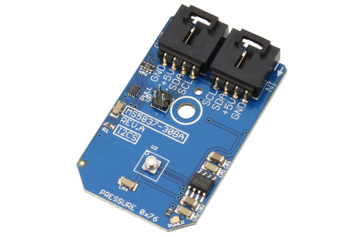

[](https://www.controleverything.com/content/Pressure?sku=MS5837-30BA01_I2CS)
# MS5837-30BA01
MS5837-30BA01 Pressure and Temperature Sensor.

The MS5837-30BA01 device provides a digital 24-bit pressure and temperature value.

This Device is available from ControlEverything.com [SKU: MS5837-30BA01_I2CS]

https://www.controleverything.com/content/Pressure?sku=MS5837-30BA01_I2CS

This Sample code can be used with Raspberry pi and Arduino.

## Java
Download and install pi4j library on Raspberry pi. Steps to install pi4j are provided at:

http://pi4j.com/install.html

Download (or git pull) the code in pi.

Compile the java program.
```cpp
$> pi4j MS5837_30BA01.java
```

Run the java program.
```cpp
$> pi4j MS5837_30BA01
```

## Python
Download and install smbus library on Raspberry pi. Steps to install smbus are provided at:

https://pypi.python.org/pypi/smbus-cffi/0.5.1

Download (or git pull) the code in pi. Run the program.

```cpp
$> python MS5837_30BA01.py
```
## Arduino
Download and install Arduino Software (IDE) on your machine. Steps to install Arduino are provided at:

https://www.arduino.cc/en/Main/Software

Download (or git pull) the code and double click the file to run the program.

Compile and upload the code on Arduino IDE and see the output on Serial Monitor.


#####The code output is the pressure in mbar and temperature reading in degree celsius and fahrenheit.
